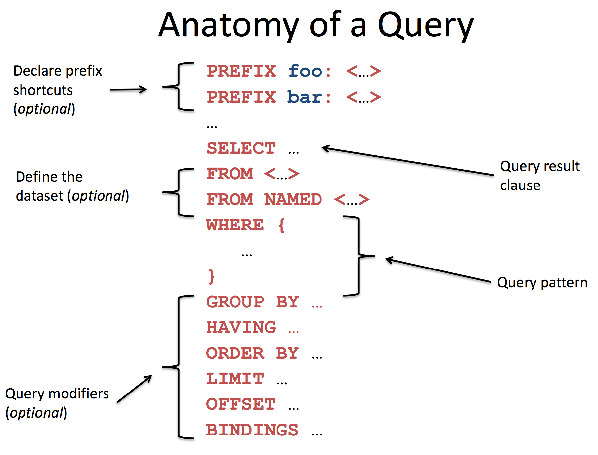

# SPARQL, made easy. 
The following two points made me create this document: 
 - **RDF are everywhere:** a large resources like WikiData and DBPedia, based on refinement of Wikipedia, very useful for NLP research. 
 - **RDF resources are mess:** There are a lot of information about using them spread around the web, which sometimes are erronous. I wanted something simple and handy that I can easily refer to, whenever I need to use it. 

For most this I am using the [SPARQL](https://en.wikipedia.org/wiki/SPARQL) query language. 

## Query tools
There are many online tools to run your queries: 
 - DBPedia's internal SPARQL tool: http://dbpedia.org/sparql
 - WikiData's SAPQL tool: https://query.wikidata.org/

So far [YASGUI](http://yasgui.org)'s been my favorite. 

## Basic Notation of SPARQL

### Prefixes 
The prefixes help shorten queries. In other words, instead of using full URLs, we define prefixes for them to make the call shorter. All prefix URLs/URIs that do not contain hostname are prefixed with the hostname of the generating wiki. 

Here is an exmple URI, if used directly in the script: 
```sparql 
<http://this.is.a/full/URI/written#out>
```
Instead we defined the following prefix
```sparql 
PREFIX foo: <http://this.is.a/URI/prefix#>
```
and later in the code we do: 
```sparql 
... foo:bar ... 
```

Often Here are the list of [prefixes for DBPedia](http://dbpedia.org/sparql?nsdecl). Also here is [a similar list of WikiData](https://www.mediawiki.org/wiki/Wikibase/Indexing/RDF_Dump_Format#Prefixes_used).  There is [this website](http://prefix.cc) to look up important global prefix names. 


### Variables
Variables are indicated by a "?" or "$" prefix. For example: 

```sparql 
?var1, ?anotherVar, ?and_one_more
```

### Comments 
You can add comments in your code, by using the `#` prefix: 
```sparql 
# This is a comment, ye ye, yo yo, ye ye ... 
```
### Literals 
 - Plain literals: `"a plain literal"`
 - Plain literal with language tag:  `“bonjour”@fr`
 - Typed literal: `"13"^^xsd:integer`
 - Some of these typed literals have shortcuts; here are some examples: 
 	- `true`  is the same as `“true”^^xsd:boolean`
	- `3`  is the same as `“3”^^xsd:integer`
	- `4.2` is the same as `“4.2”^^xsd:decimal`

### Matching patterns 
These patterns are used to select sets of triples from the RDF database 

 - Match an exact RDF triple: `ex:myWidget ex:partNumber “XY24Z1” .`
 - Match one variable: `?person foaf:name “Lee Feigenbaum” .`
 - Match multiple variables: `conf:SemTech2009 ?property ?value .`

### Highlevel view of the queries 


(picture from [here](http://www.iro.umontreal.ca/~lapalme/ift6281/sparql-1_1-cheat-sheet.pdf))

### `SELECT` and `WHERE` operator 

Use `SELECT` defines what you want and `WHERE` defines your conditions, restrictions, and filters. 
For example: 

```sparql 
SELECT ?subject ?predicate ?object
WHERE {?subject ?predicate ?object} 
LIMIT 100
```

### `SORT`ing and `GROUP`ing

```sparql  
SELECT ?predicate (COUNT(*)AS ?frequency)
WHERE {?subject ?predicate ?obDEject}
GROUP BY ?predicate
ORDER BY DESC(?frequency)
LIMIT 10
```

## Combining Results 
 - Conjunction operator `A . B`:  Join together the results of solving `A` and `B` by matching the 
 values of any variables in common.
 - Left to join `A OPTIONAL { B }`:  Join together the results of solving `A` and `B` by matching the
 values of any variables in common, if possible. Keep all solutions from A whether or
 not there’s a matching solution in `B`. 
 - Disjunction `{ A } UNION { B }`: Include both the results of solving A and the results of solving `B`.
 - Subtraction pattern `A MINUS { B }`: Solve `A`. Solve `B`. Include only those results from solving `A` 
 that are not compatible with any of the results from `B`.

## Examples:

### Getting all the Named-Entities that are "cats" 

```sparql
SELECT ?item ?itemLabel
WHERE
{
	?item wdt:P31 wd:Q146 .
	SERVICE wikibase:label { bd:serviceParam wikibase:language "en" }
}
```


### Knowing that "Saint Louis University" is a "University": 


